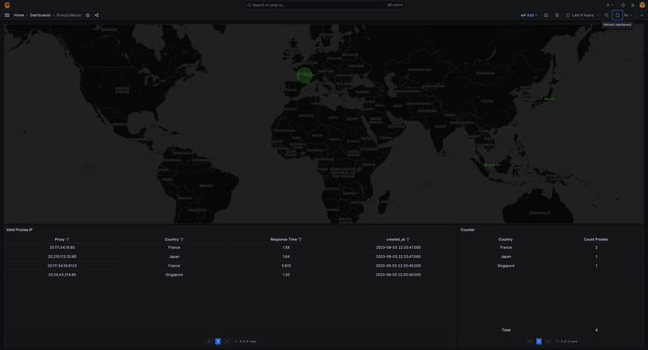

# Proxy-Collector

Script on Python for finding and checking proxies from open sources.
> [!WARNING]  
> Do not use these proxy IP addresses for everyday Internet surfing, your own social networks, banking, etc. These are not security-verified IP addresses and they can steal your personal data.


> [!IMPORTANT]  
>  Before installation **if you're use MacOS**
1. Copy content bellow into **/Library/LaunchDaemons/com.docker_1270045_alias.plist**
```xml
<?xml version="1.0" encoding="UTF-8"?>
<!DOCTYPE plist PUBLIC "-//Apple//DTD PLIST 1.0//EN" "http://www.apple.com/DTDs/PropertyList-1.0.dtd">
<plist version="1.0">
    <dict>
        <key>Label</key>
        <string>com.docker_1270045_alias</string>
        <key>ProgramArguments</key>
        <array>
            <string>ifconfig</string>
            <string>lo0</string>
            <string>alias</string>
            <string>127.0.0.45</string>
        </array>
        <key>RunAtLoad</key>
        <true/>
    </dict>
</plist>
```
2. Run command: `sudo launchctl load /Library/LaunchDaemons/com.docker_1270045_alias.plist`

## Installation
```shell
cp .env.example .env
```
```shell
make install
```
For run program you can use Makefile:
```shell
make run
```
For get arguments of script you can use help command:
```shell
make help
```

## Grafana
In a root of project you can find Grafana config **grafana.json** for monitoring of process.

By default, grafana installing with project http://127.0.0.45:3000 (user: `admin` pass: `admin`)

